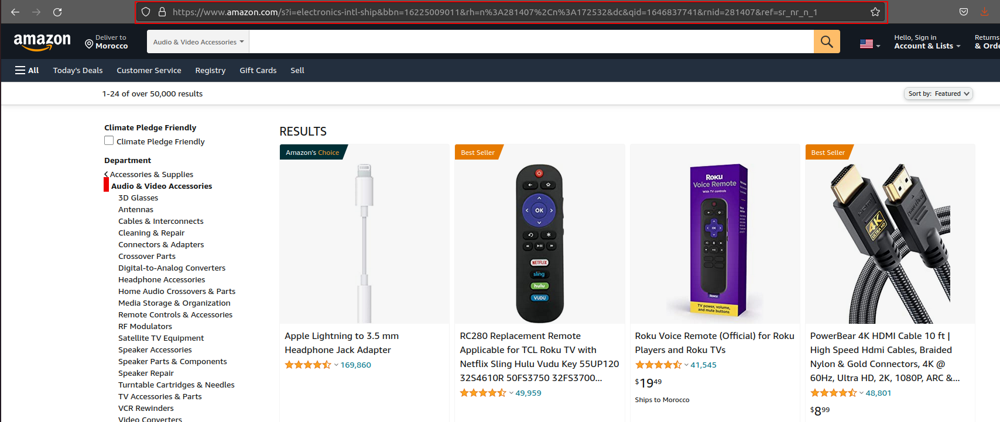

<div id="top"></div>
<div align="center">
  <h1 align="center">Amazon Scraper</h1>
</div>

is a simple and functional solution to extract data from Amazon.com. The program carefully processes the pages from the Amazon website, saving their data on your computer, with this program you can get amazon product infos, product reviews ...
<br>This program built with the python framework <a href="https://scrapy.org/">Scrapy</a>.

<!-- GETTING STARTED -->
## Installation

1. Clone the repo
   ```sh
   git clone https://github.com/mohcinsarrar/amazon-scraper.git
   ```
2. Install Scrapy
   ```sh
   pip install scrapy
   ```

<p align="right">(<a href="#top">back to top</a>)</p>

<!-- USAGE EXAMPLES -->
## Usage

### Scrape product infos
to start scraping product from an amazon category, go to the project directory, and use this command
  ```sh
     scrapy crawl product -a category="URL" -O outputFile.csv
  ```
- outputFile.csv to save the product infos
- the URL is the link of the category page


### Scrape product reviews
you can scrape reviews for one or many products using the command
  ```sh
     scrapy crawl review -a product="ASIN" -a products="path_to_csv_file_of_asin" -a maxpages=nbr -O outputFile.csv
  ```
(use one of product or products arg)
- if you want to scrape one product use product arg eqal to asin
- if you want to scrape many products use a csv file (like in amazon/asin.csv)
- maxpages: is the max number of pages you want to srape for each product
- outputFile.csv to save the products reviews
